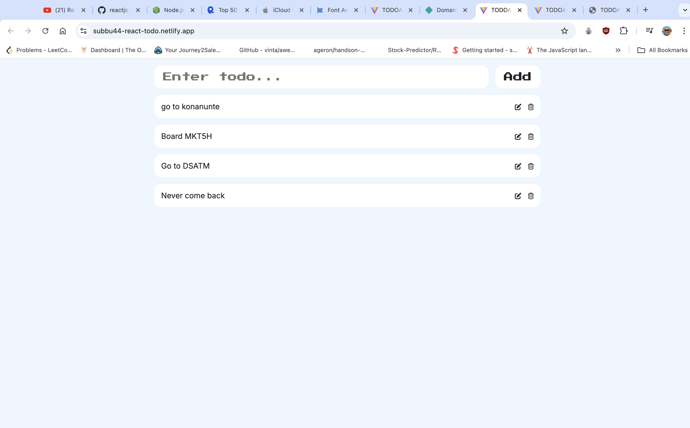

Here’s the complete `README.md` for your React TodoList CRUD app:

```markdown
# React TodoList

This is a CRUD application built with React.js to manage a todo list. You can add, edit, delete, and mark tasks as completed in this simple and intuitive app.

## Live Demo

Check out the live demo of the application: [React TodoList on Netlify](https://subbu44-react-todo.netlify.app/)

## Getting Started

Follow the steps below to clone the repository, install dependencies, and start the development server.

### Prerequisites

Make sure you have the following installed:

- [Node.js](https://nodejs.org/) (which includes npm)

### Installation

1. **Clone the repository**

   Clone this repository to your local machine using:

   ```bash
   git clone https://github.com/subramanya-44/react_todolist.git
   ```

2. **Navigate to the main directory**

   Move into the project directory:

   ```bash
   cd react_todolist
   ```

3. **Install the dependencies**

   Install all required dependencies using npm:

   ```bash
   npm install
   ```

4. **Start the development server**

   Start the development server to run the app locally:

   ```bash
   npm run dev
   ```

5. **Access the application**

   Once the development server is running, you should see a local host link like `http://localhost:3000` in your terminal. Open this link in your web browser to view the application.

## Preview




## Features

- **Add New Tasks**: Quickly add new tasks to your todo list.
- **Edit Tasks**: Modify existing tasks as needed.
- **Delete Tasks**: Remove tasks that are no longer needed.
- **Mark Tasks as Completed**: Keep track of tasks by marking them as completed.

## Technologies Used

- **React.js**: A JavaScript library for building user interfaces.
- **JavaScript (ES6+)**: The programming language used for logic and interactivity.
- **HTML5 & CSS3**: Markup and styling of the application.

## License

This project is licensed under the MIT License. See the [LICENSE](LICENSE) file for details.

```

